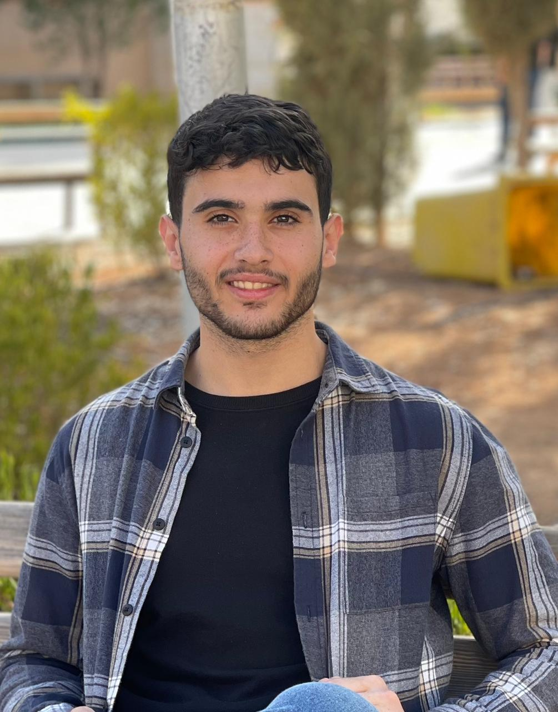

# Mohammad Abojodeh - Backend Developer Portfolio



A VS Code-inspired portfolio website showcasing my journey as a Backend Developer. This interactive portfolio presents my professional experience, technical skills, and projects through a familiar VS Code interface.

## 🚀 Live Demo

Visit my portfolio: [Your-Portfolio-URL-Here]

## 👨‍💻 About Me

I'm Mohammad Abojodeh, a passionate Backend Developer and fresh graduate from Al-Hussein Bin Talal University with a Bachelor's degree in Software Engineering. I have hands-on experience through my internship at Ulm Care and leadership in final year projects.

### 🎯 Specializations
- **Backend Development**: Node.js, ASP.NET Core
- **Databases**: PostgreSQL, SQL Server, MongoDB
- **Architecture**: Clean Architecture, RESTful APIs
- **Cloud & DevOps**: Docker, Git, CI/CD

### 💼 Experience
- **Backend Developer Intern** at Ulm Care (June-July 2025)
- **Team Leader** for AI-powered project management system (Final Project)

## 🛠️ Technologies Used

This portfolio is built with:
- **React 18** with TypeScript
- **Vite** for fast development and building
- **CSS3** with VS Code dark theme
- **Lucide React** for icons
- **Responsive Design** for all devices

## 🎨 Features

- ✅ **VS Code Interface**: Authentic VS Code look and feel
- ✅ **Interactive File Explorer**: Navigate through portfolio sections
- ✅ **Tabbed Editor**: Open multiple files simultaneously
- ✅ **Syntax Highlighting**: Code snippets with proper highlighting
- ✅ **Professional Profile**: Contact information and photo
- ✅ **Responsive Design**: Works on desktop and mobile
- ✅ **SEO Optimized**: Meta tags and descriptions

## 📁 Portfolio Structure

```
📂 About
├── personal-info.md
├── education.md
└── achievements.md

📂 Experience
├── ulm-care-internship.md
├── final-project.md
└── technical-experience.md

📂 Skills
├── backend-technologies.md
├── databases.md
├── tools-frameworks.md
└── soft-skills.md

📂 Projects
├── ai-project-management.md
├── database-systems.md
└── web-applications.md

📂 Contact
└── contact-info.md
```

## 🚀 Getting Started

### Prerequisites
- Node.js (v18 or higher)
- npm or yarn

### Installation

1. Clone the repository:
```bash
git clone [your-repo-url]
cd portfolio
```

2. Install dependencies:
```bash
npm install
```

3. Start development server:
```bash
npm run dev
```

4. Build for production:
```bash
npm run build
```

## 📱 Contact Information

- **Email**: mohamadabo654@gmail.com
- **Phone**: +962 78 123 4567
- **Location**: Amman, Jordan
- **LinkedIn**: [Your LinkedIn Profile]
- **GitHub**: [Your GitHub Profile]

## 🎯 Career Goals

I'm actively seeking opportunities as a Backend Developer where I can:
- Contribute to scalable web applications
- Work with modern backend technologies
- Collaborate with experienced development teams
- Continue learning and growing in the software industry

## 📄 License

This project is open source and available under the [MIT License](LICENSE).

---

**Built with ❤️ by Mohammad Abojodeh**
